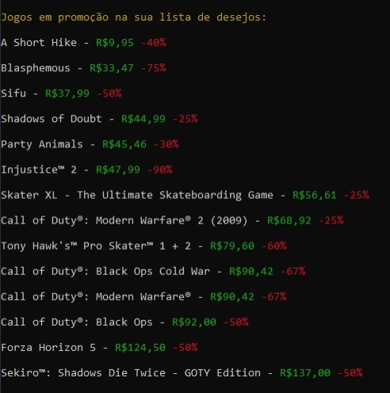

<h1>Web Scraping - Lista de Desejos da Steam</h1>

Script em <b>Python</b> para varrer uma lista de desejos da Steam a partir do ID do usuário, e listar somente os jogos em promoção, do mais barato para o mais caro.

A principal biblioteca utilizada foi a <b>selenium</b>, para poder abrir o site e buscar pelas informações necessárias.

